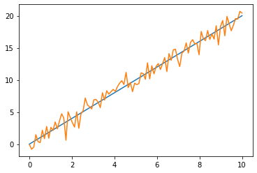
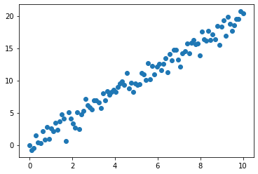

```python
 import numpy as np
    # ctrl + enter
    # [*] : 실행중
    # [1] : 실행 완료, 몇 번째 실행했는지
```


```python
#새로운 array를 생성
# 1차원 = vector, 2차원 = matrix
# https://pasus.tistory.com/106

a = np.array([1,2,3]) # 1차원 벡터 생성. 벡터는 행인지 열인지 의미가 없음
print(a.shape) # python은 디폴트로 행벡터가 생성되지만, (1,3)이 아니라 (3.)로 표시
A=np.array([[1,2],[3,4]]) # 2x2의 2차원 행렬 생성
B=np.array([[1,2,3],[4,5,6]]) #2x3의 2차원 행렬 생성
print(a)
print(A)
print(B)
```

    (3,)
    [1 2 3]
    [[1 2]
     [3 4]]
    [[1 2 3]
     [4 5 6]]
    


```python
# 0, 1 또는 특정한 값으로 초기화
# 괄호 안에 다시 괄호가 있음 주의

X = np.zeros((3,4)) # 3x4의 0으로 가득찬 행렬
Y = np.ones((2,5)) # 2x5의 1로 가득찬 행렬
Z = np.full((3,2),100) # 첫번쨰 인자의 shape으로, 두번째 인자로 가득찬 행렬

print(X)
print(Y)
print(Z)
```

    [[0. 0. 0. 0.]
     [0. 0. 0. 0.]
     [0. 0. 0. 0.]]
    [[1. 1. 1. 1. 1.]
     [1. 1. 1. 1. 1.]]
    [[100 100]
     [100 100]
     [100 100]]
    


```python
# np.arange(시작하는 값, 마지막 값(디폴트 = 포함x), 증가량(디폴트 = 1))
x = np.arange(0,10)
y = np.arange(0,10,3)

print(x)
print(y)
```

    [0 1 2 3 4 5 6 7 8 9]
    [0 3 6 9]
    


```python
# np.linspace(시작하는 값, 마지막 값(디폴트 = 포함o), 전체 개수)
x = np.linspace(0, 10, 5)
z1 = np.linspace(0, 10, 5, endpoint = True)
z2 = np.linspace(0, 10, 5, endpoint = False)

print(x)
print(z1)
print(z2)
```

    [ 0.   2.5  5.   7.5 10. ]
    [ 0.   2.5  5.   7.5 10. ]
    [0. 2. 4. 6. 8.]
    


```python
# random으로 샘플 생성
X = np.random.rand(2,3)  # [0,1] 사이의 uniform distribution을 따르는 랜덤 샘플 생성 (확률이 모두 동일)
Y = np.random.randn(2,3) # [평균=0, 분산=1]인 Normal distribution을 따르는 랜덤 샘플 생성

print(X)
print(Y)
```

    [[0.52487791 0.40149924 0.70079751]
     [0.55582744 0.93253536 0.86157272]]
    [[ 0.09208814 -0.30727183 -0.47690448]
     [ 1.21464313 -0.65271839  1.20571087]]
    


```python
# np.ndarray에 있는 속성들
z = np.ones(3)  # 1차원 array = 벡터
Z = np.ones((2,3)) # 2차원 array = 행렬

# ndim : 1 = 벡터, 2 = 행렬 'n dimension'
# shape : [몇 행, ] or [몇 행, 몇 열]
# size : 전체 스칼라의 개수 = 행x열
print(z.ndim, z.shape, z.size)
print(Z.ndim, Z.shape, Z.size)

print(z)
print(Z)
```

    1 (3,) 3
    2 (2, 3) 6
    [1. 1. 1.]
    [[1. 1. 1.]
     [1. 1. 1.]]
    


```python
# reshape 

a=np.arange(0, 12) # 1차원 벡터, 12x1
b=a.reshape(4,3) # a를 4x3으로 reshape. 행부터 채운다
c=b.reshape(6,2)
# d=c.reshape(5,2) => size가 안맞아 오류

print(a)
print(b)
print(c)
```

    [ 0  1  2  3  4  5  6  7  8  9 10 11]
    [[ 0  1  2]
     [ 3  4  5]
     [ 6  7  8]
     [ 9 10 11]]
    [[ 0  1]
     [ 2  3]
     [ 4  5]
     [ 6  7]
     [ 8  9]
     [10 11]]
    


```python
# array의 값에 접근하는 방법
a = np.arange(0,12) # 1차원 벡터, 12x1
a = a.reshape(3,4)

print(a)
print(a[0, 3]) # 0부터 세는거 주의
print(a[0:3, 3]) # a[[0, 2], 3] = 1행~3행, 4열
print(a[0, 0:2]) # a[0. [0,1]] = 1행 , 1열~2열

print(a[-1, -1]) # -1 = 마지막 위치, [-1,-1] = 마지막 행, 마지막 열
print(a[-2, -2]) # -2 = 마지막에서 두 번째, [-2, -2] = 마지막에서 두 번째 행, 마지막에서 두 번째 열
print(a[1:-1, -2]) # a[1:2. -2] = a[1, -2]
print(a[1, 1:-1]) # a[1, 1:3] = a[1, [1,2]]

print(a[1:, 2:]) # 2행~마지막행, 3열~마지막열
```

    [[ 0  1  2  3]
     [ 4  5  6  7]
     [ 8  9 10 11]]
    3
    [ 3  7 11]
    [0 1]
    11
    6
    [6]
    [5 6]
    [[ 6  7]
     [10 11]]
    


```python
import matplotlib.pyplot as plt

x = np.linspace(0,10, 100)
y = 2*x
z = 2*x + np.random.randn(100) # 노이즈 추가

# plt.plot(가로축, 세로축) : 순서대로 직선으로 연결
plt.figure() # 새 그림판
plt.plot(x,y) 
plt.plot(x,z) 

# plt.scatter(가로축, 세로축) : 점을 찍음
plt.figure()
plt.scatter(x,z)
```


    <matplotlib.collections.PathCollection at 0x1af2f2a90a0>


    

    


    

    

