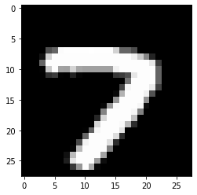

```python
# 일반적인 neural network

import numpy as np
import matplotlib.pyplot as plt

import keras
from keras.datasets import mnist

from keras.models import Sequential
from keras.layers import Dense, Dropout, Flatten
from keras.layers.convolutional import Conv2D

# read
(x_train, y_train), (x_test, y_test) = mnist.load_data()

# x_train = N x row x col
img_rows = x_train.shape[1] # 28
img_cols = x_train.shape[2] # 28

batch_size = 128 # mini-batch의 크기     6만개를 128개 단위로 나눌거임 => 469 개
num_classes = 10 # class의 개수
epochs = 10 # epoch을 몇번 돌건지

# preprocess
x_train = x_train.reshape(x_train.shape[0], img_rows, img_cols)
x_test = x_test.reshape(x_test.shape[0], img_rows, img_cols)

x_train = x_train.astype('float32') / 255. # 0~255 정수 -> 0~1 실수
x_test = x_test.astype('float32') / 255.

print('x_train shape:', x_train.shape)
print(x_train.shape[0], 'train samples')
print(x_test.shape[0], 'test samples')

# output label integer => one-hot coding
y_train = keras.utils.np_utils.to_categorical(y_train, num_classes)
y_test = keras.utils.np_utils.to_categorical(y_test, num_classes)

# MLP model
model = Sequential()
model.add(Flatten(input_shape = (img_rows,img_cols))) # 2D image -> 1D vector
model.add(Dense(200, activation = 'relu'))
model.add(Dense(num_classes, activation = 'softmax'))
model.summary()

# learning
model.compile(loss = 'categorical_crossentropy', metrics = ['accuracy'])
hist = model.fit(x_train, y_train, batch_size = batch_size, epochs = epochs,
                 verbose = 1, validation_data = (x_test, y_test))    # verbose : 매번 출력
```

    Downloading data from https://storage.googleapis.com/tensorflow/tf-keras-datasets/mnist.npz
    11490434/11490434 [==============================] - 0s 0us/step
    x_train shape: (60000, 28, 28)
    60000 train samples
    10000 test samples
    Model: "sequential"
    _________________________________________________________________
     Layer (type)                Output Shape              Param #   
    =================================================================
     flatten (Flatten)           (None, 784)               0         
                                                                     
     dense (Dense)               (None, 200)               157000    
                                                                     
     dense_1 (Dense)             (None, 10)                2010      
                                                                     
    =================================================================
    Total params: 159,010
    Trainable params: 159,010
    Non-trainable params: 0
    _________________________________________________________________
    Epoch 1/10
    469/469 [==============================] - 12s 23ms/step - loss: 0.3061 - accuracy: 0.9133 - val_loss: 0.1643 - val_accuracy: 0.9528
    Epoch 2/10
    469/469 [==============================] - 6s 12ms/step - loss: 0.1389 - accuracy: 0.9591 - val_loss: 0.1169 - val_accuracy: 0.9641
    Epoch 3/10
    469/469 [==============================] - 6s 12ms/step - loss: 0.0950 - accuracy: 0.9725 - val_loss: 0.0954 - val_accuracy: 0.9713
    Epoch 4/10
    469/469 [==============================] - 5s 11ms/step - loss: 0.0723 - accuracy: 0.9786 - val_loss: 0.0822 - val_accuracy: 0.9758
    Epoch 5/10
    469/469 [==============================] - 3s 7ms/step - loss: 0.0577 - accuracy: 0.9831 - val_loss: 0.0762 - val_accuracy: 0.9763
    Epoch 6/10
    469/469 [==============================] - 3s 7ms/step - loss: 0.0462 - accuracy: 0.9865 - val_loss: 0.0801 - val_accuracy: 0.9774
    Epoch 7/10
    469/469 [==============================] - 3s 7ms/step - loss: 0.0387 - accuracy: 0.9888 - val_loss: 0.0697 - val_accuracy: 0.9800
    Epoch 8/10
    469/469 [==============================] - 3s 7ms/step - loss: 0.0321 - accuracy: 0.9905 - val_loss: 0.0696 - val_accuracy: 0.9808
    Epoch 9/10
    412/469 [=========================>....] - ETA: 0s - loss: 0.0260 - accuracy: 0.9924


    ---------------------------------------------------------------------------

    KeyboardInterrupt                         Traceback (most recent call last)

    <ipython-input-1-9df142e32235> in <module>
         46 # learning
         47 model.compile(loss = 'categorical_crossentropy', metrics = ['accuracy'])
    ---> 48 hist = model.fit(x_train, y_train, batch_size = batch_size, epochs = epochs,
         49                  verbose = 1, validation_data = (x_test, y_test))    # verbose : 매번 출력
    

    /usr/local/lib/python3.8/dist-packages/keras/utils/traceback_utils.py in error_handler(*args, **kwargs)
         62     filtered_tb = None
         63     try:
    ---> 64       return fn(*args, **kwargs)
         65     except Exception as e:  # pylint: disable=broad-except
         66       filtered_tb = _process_traceback_frames(e.__traceback__)
    

    /usr/local/lib/python3.8/dist-packages/keras/engine/training.py in fit(self, x, y, batch_size, epochs, verbose, callbacks, validation_split, validation_data, shuffle, class_weight, sample_weight, initial_epoch, steps_per_epoch, validation_steps, validation_batch_size, validation_freq, max_queue_size, workers, use_multiprocessing)
       1407                 _r=1):
       1408               callbacks.on_train_batch_begin(step)
    -> 1409               tmp_logs = self.train_function(iterator)
       1410               if data_handler.should_sync:
       1411                 context.async_wait()
    

    /usr/local/lib/python3.8/dist-packages/tensorflow/python/util/traceback_utils.py in error_handler(*args, **kwargs)
        148     filtered_tb = None
        149     try:
    --> 150       return fn(*args, **kwargs)
        151     except Exception as e:
        152       filtered_tb = _process_traceback_frames(e.__traceback__)
    

    /usr/local/lib/python3.8/dist-packages/tensorflow/python/eager/def_function.py in __call__(self, *args, **kwds)
        913 
        914       with OptionalXlaContext(self._jit_compile):
    --> 915         result = self._call(*args, **kwds)
        916 
        917       new_tracing_count = self.experimental_get_tracing_count()
    

    /usr/local/lib/python3.8/dist-packages/tensorflow/python/eager/def_function.py in _call(self, *args, **kwds)
        945       # In this case we have created variables on the first call, so we run the
        946       # defunned version which is guaranteed to never create variables.
    --> 947       return self._stateless_fn(*args, **kwds)  # pylint: disable=not-callable
        948     elif self._stateful_fn is not None:
        949       # Release the lock early so that multiple threads can perform the call
    

    /usr/local/lib/python3.8/dist-packages/tensorflow/python/eager/function.py in __call__(self, *args, **kwargs)
       2451       (graph_function,
       2452        filtered_flat_args) = self._maybe_define_function(args, kwargs)
    -> 2453     return graph_function._call_flat(
       2454         filtered_flat_args, captured_inputs=graph_function.captured_inputs)  # pylint: disable=protected-access
       2455 
    

    /usr/local/lib/python3.8/dist-packages/tensorflow/python/eager/function.py in _call_flat(self, args, captured_inputs, cancellation_manager)
       1858         and executing_eagerly):
       1859       # No tape is watching; skip to running the function.
    -> 1860       return self._build_call_outputs(self._inference_function.call(
       1861           ctx, args, cancellation_manager=cancellation_manager))
       1862     forward_backward = self._select_forward_and_backward_functions(
    

    /usr/local/lib/python3.8/dist-packages/tensorflow/python/eager/function.py in call(self, ctx, args, cancellation_manager)
        495       with _InterpolateFunctionError(self):
        496         if cancellation_manager is None:
    --> 497           outputs = execute.execute(
        498               str(self.signature.name),
        499               num_outputs=self._num_outputs,
    

    /usr/local/lib/python3.8/dist-packages/tensorflow/python/eager/execute.py in quick_execute(op_name, num_outputs, inputs, attrs, ctx, name)
         52   try:
         53     ctx.ensure_initialized()
    ---> 54     tensors = pywrap_tfe.TFE_Py_Execute(ctx._handle, device_name, op_name,
         55                                         inputs, attrs, num_outputs)
         56   except core._NotOkStatusException as e:
    

    KeyboardInterrupt: 


```python
n = np.random.randint(0,10000,1)

plt.figure(figsize = (4,4))
plt.imshow(x_test[n].reshape(28, 28), cmap = 'gray')

print('The Answer is ', np.argmax(model.predict(x_test[n]), axis = -1))
```


```python
# CNN

# read
batch_size = 128 # mini-batch의 크기
num_classes = 10 # class의 개수
epochs = 5 # epoch을 몇번 돌건지

# preprocess
input_shape = (img_rows, img_cols, 1)

x_train = x_train.reshape(x_train.shape[0], img_rows, img_cols, 1)
x_test = x_test.reshape(x_test.shape[0], img_rows, img_cols, 1)

print('x_train shape:', x_train.shape)
print(x_train.shape[0], 'train samples')
print(x_test.shape[0], 'test samples')

# CNN model
model = Sequential()
model.add(Conv2D(20, kernel_size = (4, 4), strides = (2, 4), padding = 'same', activation = 'relu',input_shape=input_shape))
model.add(Conv2D(50, kernel_size = (3, 3), strides = (2, 1), padding = 'same', activation = 'relu'))
model.add(Flatten())
model.add(Dense(100, activation = 'relu'))
model.add(Dense(num_classes, activation = 'softmax'))
model.summary()

# learning
model.compile(loss = 'categorical_crossentropy', metrics = ['accuracy'])
hist = model.fit(x_train, y_train, batch_size = batch_size, epochs = epochs,
                 verbose = 1, validation_data = (x_test, y_test))
```

    x_train shape: (60000, 28, 28, 1)
    60000 train samples
    10000 test samples
    Model: "sequential_5"
    _________________________________________________________________
     Layer (type)                Output Shape              Param #   
    =================================================================
     conv2d_8 (Conv2D)           (None, 14, 7, 20)         340       
                                                                     
     conv2d_9 (Conv2D)           (None, 7, 7, 50)          9050      
                                                                     
     flatten_5 (Flatten)         (None, 2450)              0         
                                                                     
     dense_10 (Dense)            (None, 100)               245100    
                                                                     
     dense_11 (Dense)            (None, 10)                1010      
                                                                     
    =================================================================
    Total params: 255,500
    Trainable params: 255,500
    Non-trainable params: 0
    _________________________________________________________________
    Epoch 1/5
    469/469 [==============================] - 23s 47ms/step - loss: 0.2549 - accuracy: 0.9233 - val_loss: 0.0804 - val_accuracy: 0.9754
    Epoch 2/5
    469/469 [==============================] - 19s 40ms/step - loss: 0.0708 - accuracy: 0.9782 - val_loss: 0.0646 - val_accuracy: 0.9787
    Epoch 3/5
    469/469 [==============================] - 15s 32ms/step - loss: 0.0467 - accuracy: 0.9854 - val_loss: 0.0478 - val_accuracy: 0.9840
    Epoch 4/5
    469/469 [==============================] - 17s 36ms/step - loss: 0.0344 - accuracy: 0.9894 - val_loss: 0.0442 - val_accuracy: 0.9866
    Epoch 5/5
    469/469 [==============================] - 15s 31ms/step - loss: 0.0256 - accuracy: 0.9921 - val_loss: 0.0427 - val_accuracy: 0.9858
    


```python
n = np.random.randint(0,10000,1)

plt.figure(figsize = (4,4))
plt.imshow(x_test[n].reshape(28, 28), cmap = 'gray')

print('The Answer is ', np.argmax(model.predict(x_test[n]), axis = -1))
```

    1/1 [==============================] - 0s 140ms/step
    The Answer is  [7]
    


    

    

